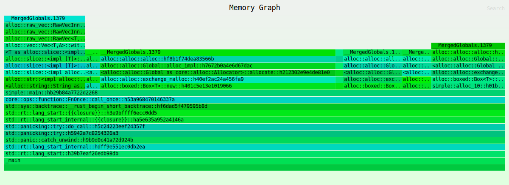

# memtrace

## MemTrace


A Rust-based tool for visualizing heap memory consumption using flamegraphs. It helps you profile your app

### Installation

```bash
cargo install memtrace
```

### Usage

```bash
memtrace <your_program>
```

License: MIT
